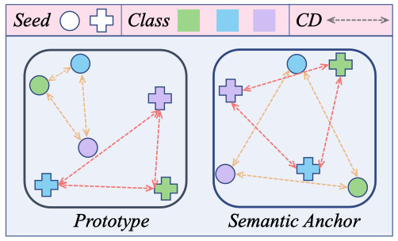
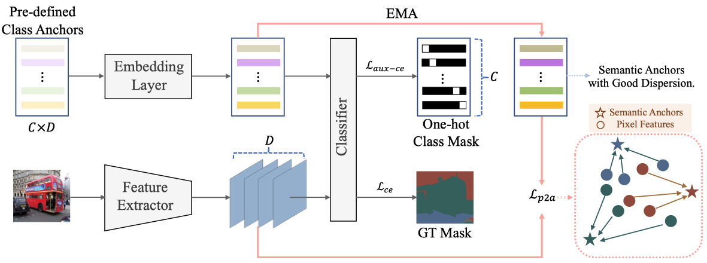

# **Beyond Prototypes: Semantic Anchor Regularization for Better Representation Learning**


## Overview
[Arxiv](https://arxiv.org/pdf/2312.11872.pdf)

One of the ultimate goals of representation learning is to achieve compactness within a class and well-separability between classes. Many outstanding metric-based and prototypebased methods following the Expectation-Maximization paradigm, have been proposed for this objective. However, they inevitably introduce biases into the learning process, particularly with long-tail distributed training data. In this paper, we reveal that the class prototype is not necessarily to be derived from training features and propose a novel perspective to use pre-defined class anchors serving as feature centroid to unidirectionally guide feature learning.&#x20;



However, the pre-defined anchors may have a large semantic distance from the pixel features, which prevents them from being directly applied. To address this issue and generate feature centroid independent from feature learning, a simple yet effective Semantic Anchor Regularization (SAR) is proposed. SAR ensures the interclass separability of semantic anchors in the semantic space by employing a classifier-aware auxiliary cross-entropy loss during training via disentanglement learning. By pulling the learned features to these semantic anchors, several advantages can be attained: 1) the intra-class compactness and naturally inter-class separability, 2) induced bias or errors from feature learning can be avoided, and 3) robustness to the long-tailed problem. The proposed SAR can be used in a plug-and-play manner in the existing models. Extensive experiments demonstrate that the SAR performs better than previous sophisticated prototype-based methods.




## Install

*Our implementation is based on the mmsegmentation V-0.29.1. *

We thank their authors for making the source code publicly available.

```Shell
conda create -n sar python=3.8 -y 
conda install pytorch==1.7.1 torchvision==0.8.2 torchaudio==0.7.2 cudatoolkit=11.0 -c pytorch
pip install -U openmim==0.3.6
mim install mmcv-full==1.7.0
pip install -v -e.
pip install prettytable==3.6.0
pip install yapf==0.40.0
conda install matplotlib
```

## Prepare Datasets and Pretrained Weights

Refer to the [Docs](https://mmsegmentation.readthedocs.io/en/latest/user_guides/2_dataset_prepare.html)

## Quick Start

### Training on multiple GPUs

```bash
bash tools/dist_train.sh report_cfgs/${CONFIG_FILE} ${GPU_NUM} [optional arguments]
```

### Testing&#x20;

```bash
# single gpu
python tools/test.py report_cfgs/${CONFIG_FILE} ${CHECKPOINT_FILE} [optional arguments]
# multi gpus.
bash tools/dist_test.sh report_cfgs/${CONFIG_FILE} ${CHECKPOINT_FILE} ${GPU_NUM} --eval mIoU [optional arguments]
```

## Checkpoints
We provide checkpoints of SAR for different benchmarks at [here](https://drive.google.com/drive/folders/1EQupo15kVjoaPpQDh2tbZdDAxYzH-swN). You can use these checkpoints directly to test the standard model.
## BibTeX

```bibtex
@article{ge2023beyond,
  title={Beyond Prototypes: Semantic Anchor Regularization for Better Representation Learning},
  author={Ge, Yanqi and Nie, Qiang and Huang, Ye and Liu, Yong and Wang, Chengjie and Zheng, Feng and Li, Wen and Duan, Lixin},
  journal={arXiv preprint arXiv:2312.11872},
  year={2023}
}
```
